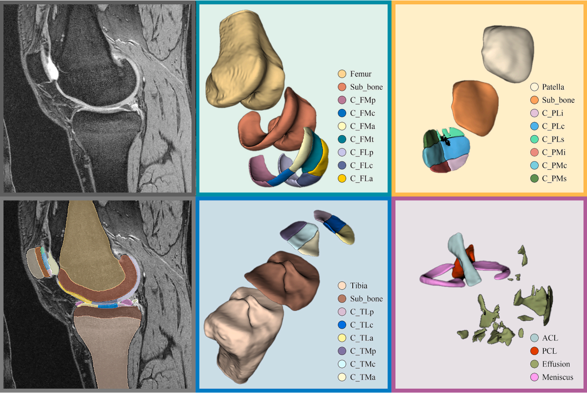

# Total Knee Radiomic Feature Atlas (Radkneeatlas)

This repository accompanies the following publication:

> Mu L, Fu J, Li M, et al.  
>  **Total knee radiomic feature atlas derived from magnetic resonance imaging segmentation: Insights into osteoarthritis incidence predictors.**  
>  *European Journal of Radiology.* 2026;194:112480.  
>  DOI: 10.1016/j.ejrad.2025.112480

---

## Dataset

The dataset associated with this work (automatic 29-structure knee MRI segmentations and corresponding radiomic feature atlas) is currently being curated.

---

## Overview

This work proposes **Radkneeatlas**, a *total knee radiomic feature atlas* derived from 3D MRI segmentation of **29 knee substructures**, designed to identify individuals at high risk of incident knee osteoarthritis (KOA) *before* radiographic diagnosis.

Using sagittal 3D DESS MRI from the Osteoarthritis Initiative (OAI), we:

- Identified participants with baseline **Kellgren–Lawrence (KL) grade < 2** and 4-year follow-up, and matched KOA occurrence vs. non-occurrence using propensity score matching (age, sex, BMI, race).
- Trained a fully automatic **nnU-Net–based** segmentation model for 29 anatomical structures, including:
  - 6 bone-related structures (femur, tibia, patella and their subchondral bones),
  - 19 cartilage subregions, and
  - 4 irregular structures (effusion, meniscus, ACL, PCL).
- Achieved high segmentation performance (mean Dice coefficient ≈ **0.96**) across all substructures.
- Extracted **3,219 radiomic features per knee** from 29 volumes of interest (shape, first-order, and texture features), then performed:
  - Univariate filtering,
  - Correlation-based redundancy reduction,
  - LASSO-based feature selection, and
  - Cross-validated logistic regression–based ranking.
- Constructed the **Radkneeatlas KOA-risk model** using 129 selected features, with an optimized subset of **18 feature-level predictors**.

In the independent test set, the Radkneeatlas model achieved:

- **AUC = 0.918** (95% CI 0.841–0.954) for predicting 4-year KOA occurrence,
- Balanced sensitivity, specificity, and precision suitable for risk stratification.

We also performed a multi-reader, multi-case experiment with junior orthopedic surgeons:

- Without AI assistance, surgeons showed modest accuracy when predicting 4-year KOA occurrence from baseline MRI alone.
- With Radkneeatlas assistance, their mean accuracy and sensitivity improved substantially, demonstrating the **practical clinical value** of the atlas as a decision-support tool.

At the structure level, three “pioneer” imaging biomarkers stood out as important precursors of KOA:

- **Femoral trochlear cartilage**  
- **Tibial subchondral bone**  
- **Knee effusion**

Together with feature-level radiomics, these structures help reveal early pathophysiologic changes that precede conventional radiographic KOA.

---

## Key Figure



**Figure 1. Overview of the Radkneeatlas pipeline and KOA risk prediction framework.**  
Baseline sagittal 3D DESS MRI from the OAI are processed with a fully automated nnU-Net model to segment 29 knee substructures (bones, cartilage subregions, and irregular structures such as effusion, meniscus, ACL, and PCL). Radiomic features are extracted from each segmented volume of interest to build the total knee radiomic feature atlas (Radkneeatlas). After feature selection and logistic regression modeling, a compact set of structure- and feature-specific predictors yields high-performance prediction of 4-year KOA occurrence and highlights early imaging biomarkers such as femoral trochlear cartilage, tibial subchondral bone, and effusion.

> *Note:* This figure is exported from the published article. Please follow the journal’s policies on figure reuse and citation when using it in presentations or derivative works.

---

## Planned contents of this repository

As the project evolves, this repository will collect:

- **Dataset links and documentation**
  - Download instructions and directory structure for the 29-structure segmentation and radiomic atlas.
- **Model and code snippets**
  - Example scripts to:
    - Load segmentations and MRI volumes.
    - Recompute or inspect radiomic features.
    - Apply trained logistic regression models for KOA risk prediction.
- **Reproducibility materials**
  - Configuration files and notes for nnU-Net-based segmentation.
  - Example notebooks illustrating how to:
    - Visualize Radkneeatlas on individual subjects.
    - Reproduce key ROC and calibration plots.
    - Explore structure-specific and feature-specific predictors.

---

## Citation

If you use this repository, code, or future datasets in your research, please cite:

```bibtex
@article{Mu2026Radkneeatlas,
  title   = {Total knee radiomic feature atlas derived from magnetic resonance imaging segmentation: Insights into osteoarthritis incidence predictors},
  author  = {Mu, Lin and Fu, Jiahui and Li, Mingyang and Liu, Haoyu and Dong, Dong and Gong, Jiaqi and Jiang, Yueluan and Huai, Xiaochen and Xu, Peng and Zhang, Huimao},
  journal = {European Journal of Radiology},
  year    = {2026},
  volume  = {194},
  pages   = {112480},
  doi     = {10.1016/j.ejrad.2025.112480}
}
